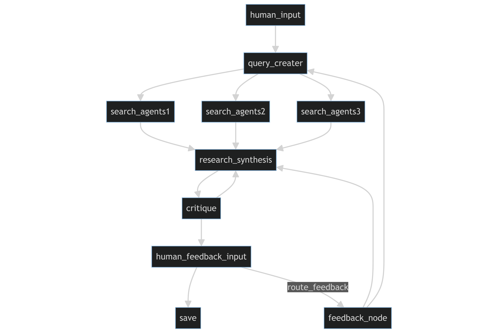
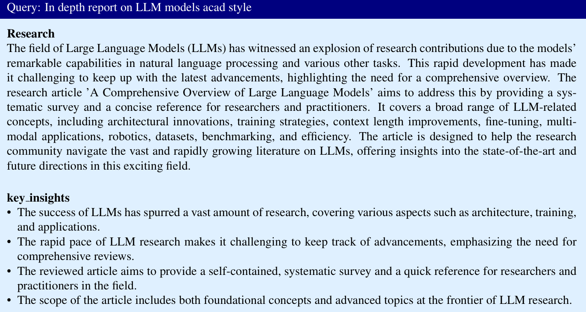

# Multi-Agent Research Workflow Using CREW AI

This repository contains the implementation of innovative research workflows based on a **multi-agent architecture** using CREW AI. The new workflow counters all limitations imposed by its predecessor [Link](../langgraph) and distributes tasks among seven agents, each assigned to a particular specialty, improving efficiency, adaptability, and scalability.

---

## Features

- **Multi-Agent System**:  
  The workflow utilizes seven specialized agents to handle different subtasks, ensuring modularity and efficiency:  
  - **Query Creator**: Dynamically generates optimized queries from human inputs.  
  - **Search Agents**: Three parallel agents retrieve information from web and database.  
  - **Research Synthesis**: Combines acquired data into well-structured and understandable report.  
  - **Critique Agent**: Automatic evaluation of synthesized research for coherence, thoroughness, and logical consistency.  
  - **Human Feedback Agent**: Processes feedback from users and decides whether to rewrite part of the workflow or restart the whole process.  

- **Dynamic Query Generation**: Inquiries highly relevant and adapted to the research topic, increasing the quality of web searches.  

- **Self-Critique and Improvement**: The critique agent allows for autonomic development of research outputs without much human intervention.

- **CREW AI Integration**: CREW AI bridges the gap between agents in a seamless task routing for effective collaboration.  

- **Language Model (LLM)**: Uses Cohere to create requests and analyzes text.  

- **Web Search**: Uses DuckDuckGo so that searching in the web can be reliable, diverse, and above all private.

---

## Architecture

The multi-agent design entails distributing tasks to independent agents; this; in significant ways, improves flexibility in the workflow. Each agent has a role, and communication between the agents on the delegation and coordination of tasks is implemented through CREW AI. This eliminates bottlenecks and ensures that the system dynamically adapts to different research requirements.

---

## Improvements Over the Initial Workflow

- **Dynamic Queries**: Enhanced and flexible queries improve data fetch. 
- **Self-Improvement**: The critique agent guarantees self-upgrade of outputs. 
- **Efficient Feedback Handling**: Human feedback agent decides whether to revise particular sections or start afresh. 
- **Scalable Design**: Highly scalable because of multi-agent architecture for complex research tasks.

---

## Results
An example report generated is shown in the below figure

